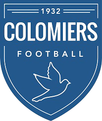

<!DOCTYPE html>
<html lang="fr">
<head>
    <meta charset="UTF-8">
    <meta name="viewport" content="width=device-width, initial-scale=1.0">
    <title>Mon site</title>
    <link rel="stylesheet" href="style.css">
</head>
<body>
    <header>
        <h1 class="logo"></h1>
    </header>

    <nav>
        <h2>Menu</h2>
        <ul>
            <li><a href="actualité.html">Actualité</a></li>
            <li><a href="statistique.html">Statistiques</a></li>
            <li><a href="classement.html">Classement</a></li>
            <li><a href="S2425.html">Calendrier/Résultats</a></li>
            <li><a href="photo.html">Photo</a></li>
        </ul>
    </nav>

    <main>
        <!-- Votre contenu principal ici -->
    </main>

    <footer>
        <!-- Votre pied de page ici -->
    </footer>
</body>
</html>
